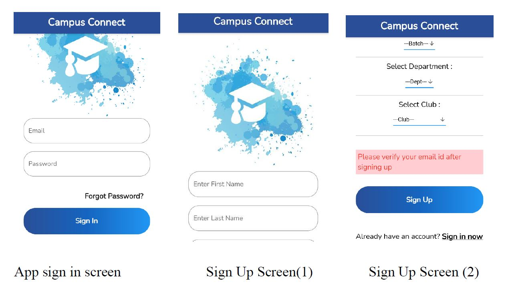
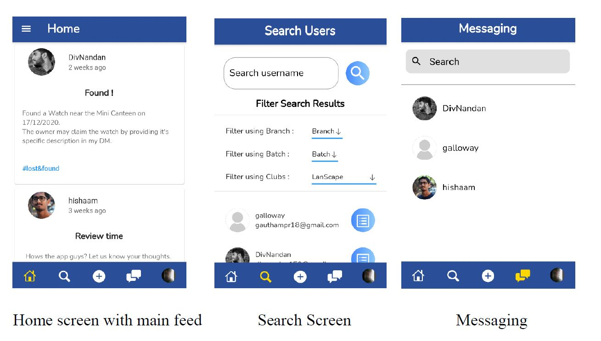
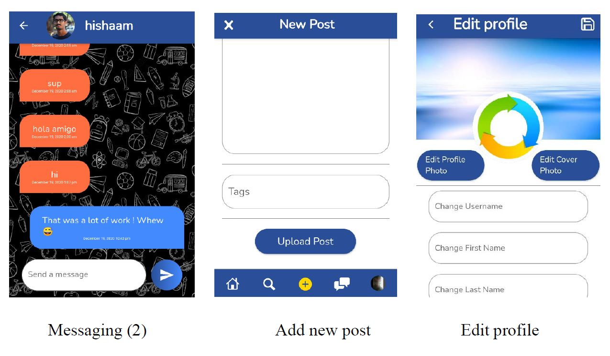
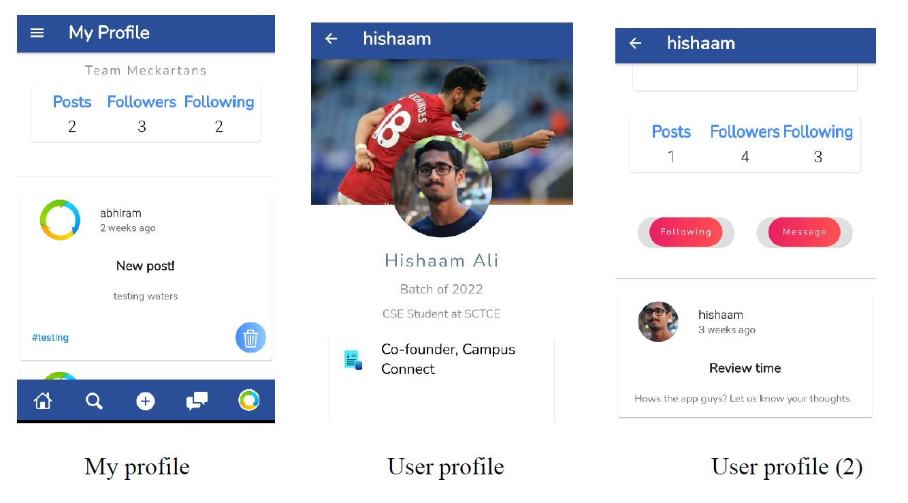
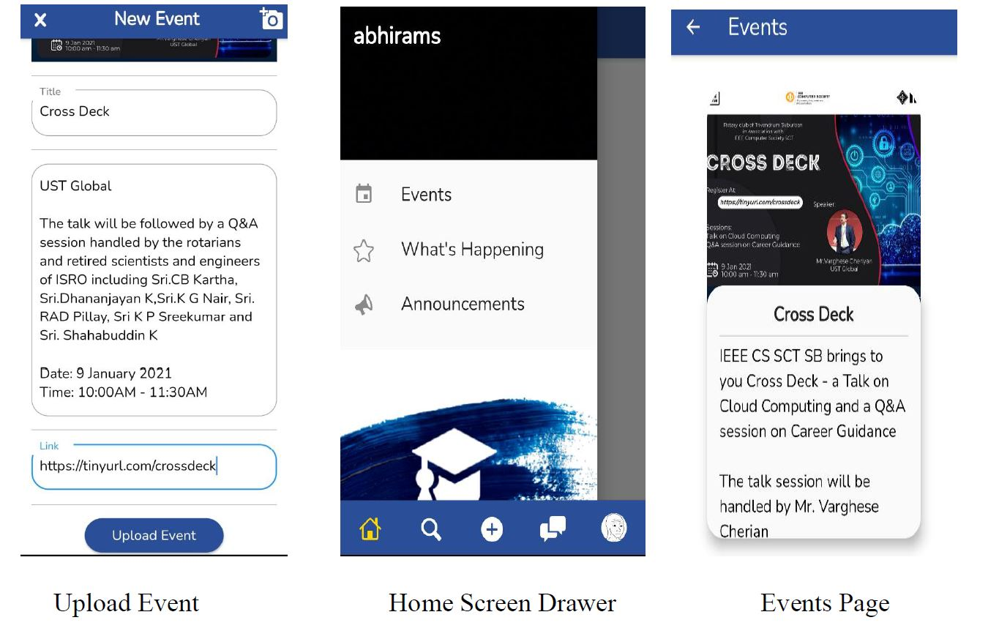

# Campus Connect

An Intra Campus Social Networking Platform.

## About

Campus Connect is an intra campus social networking platform where students can find peers who share similiar interests. The platform serves as a one stop portal for information regarding the various activities in the college.

## Development

Frontend using Flutter framework 
Backend handled by Firebase

## Features

1. Sign in / Sign up with email authentication
2. Search options with filters : Year of passout, Branch, Club affinity
3. Follow users
4. View profile
5. Feed page
6. Create posts
7. Messaging
8. Edit your profile
9. View upcoming events, current news and announcements of your college

## Developers

Hishaam Ali 
Div Nandan 
Abhiram S

## Screenshots

 </img>
 </img>
 </img>
 </img>
 </img>
